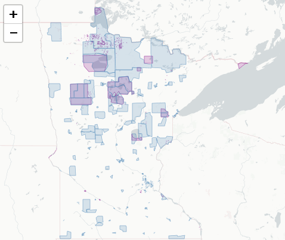
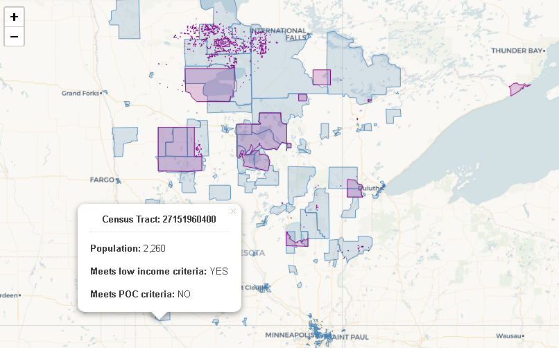

# mpcaej

This package contains two shapefiles provided by the MN Pollution
Control Agency:

- `ej_areas` *(blue below)*: Census Tract polygons and deomgraphic data
  for areas that meet MPCA’s Environmental Justice criteria.

- `tribal_areas` *(purple below)*: Areas and names of Tribal Nations and
  communities neighboring Minnesota.



## Install

To install `mpcaej` from github:

``` r
# First install the 'remotes' package
install.packages("remotes")

# Install the development version from GitHub
remotes::install_github("tidy-MN/mpcaej")
```

------------------------------------------------------------------------

## Use

To load the shapefiles into your workspace:

``` r
library(mpcaej)

# Census Tract information
ej <- get_ej_areas()

# Tribal area polygons
tribal_areas <- get_tribal_areas()
```

## Leaflet map of polygons

``` r
map_ej()
```


